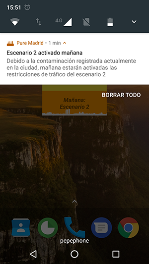
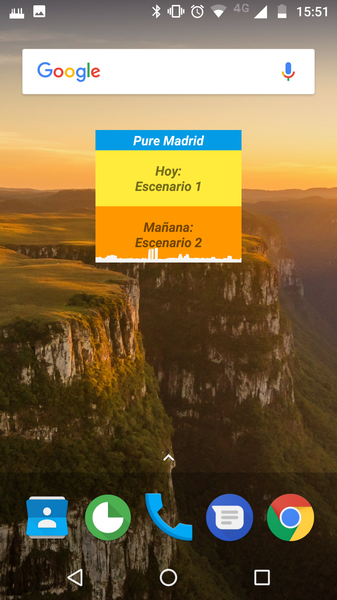
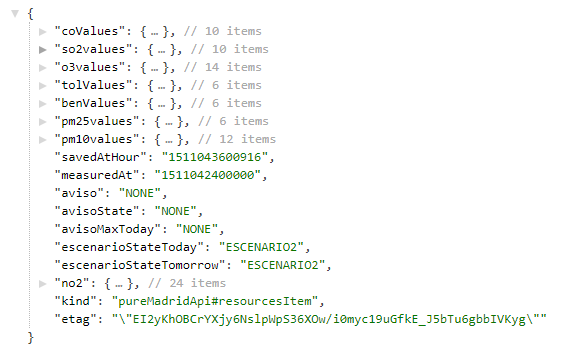

# Pure Madrid

Este proyecto consiste en una aplicación desarrollada para la plataforma Android que permite a los ciudadanos de Madrid conocer toda la información relativa al aire de la ciudad, incluyendo las restricciones de tráfico aplicadas en cada momento.

El propósito de esta app es mostrar el nivel de contaminación de la ciudad de Madrid en tiempo real y también toda la información correspondiente a los protocolos de contaminación mediante el envío de notificaciones. Los destinatarios de la app son los ciudadanos de Madrid y también aquellas personas que visiten la ciudad, aunque les será de más utilidad a todos aquellos que utilicen habitualmente el vehículo privado para desplazarse. 

La app está disponible en Google Play desde el mes de octubre para permitir que los ciudadanos la disfrutasen durante toda la temporada de contaminación elevada y puede obtenerse en el siguiente enlace:
https://play.google.com/store/apps/details?id=com.albaitdevs.puremadrid

Durante este periodo, la app ha sido instalada por más de 1000 ciudadanos que han recibido notificaciones automáticas durante los tres episodios de contaminación elevada que han tenido lugar esta temporada, siendo el más prolongado el de mediados de noviembre con una duración superior a una semana.

Además, de entre todos los usuarios que han disfrutado de la app, más de 35 han valorado la aplicación con una nota media de 4,9 sobre 5 en Google Play

## Promotor

* Javier Delgado Aylagas

## Funcionalidad

* La página principal contiene los avisos del protocolo de contaminación para hoy y mañana (junto con el envío de notificaciones automáticas)
* Mapa con los datos de todas las estaciones y todos los contaminantes con datos históricos desde el 1 de enero de 2017.
* Previsión oficial para hoy y mañana
* Widget de escritorio que muestra los escenarios activados.
* Documentación explicando los detalles del protocolo de contaminación.
* Enlaces a la web oficial y a los boletines diarios de contaminación oficiales.

## Cómo utilizar la app:

Nada mas abrir la aplicación, veremos el estado del aire en este instante, y en el momento que cambie se verá el estado de la aplicación:

Para que el usuario disponga de la información tan pronto como es publicada, recibirá una notificación con la información más relevante:

Al pulsar sobre los estados de hoy o mañana, veremos las afecciones que tiene el escenario actual para el tráfico:

En la sección de mapa, podremos ver los datos de diferentes tipos de contaminantes, tanto sobre un mapa coloreado, como seleccionando en los medidores para poder ver datos más concretos. Además, el color del medidor cambiará a amarillo si se supera el nivel de preaviso (180 microgramos/m3), a naranja si se supera el nivel de aviso (200 microgramos/m3) y a rojo si se supera el nivel de alerta (400 microgramos/m3).

Para consultar los datos históricos, simplemente hay que pulsar sobre el botón de calendario y cambiar la fecha:

También se puede consultar la previsión oficial de contaminación, a parte del documento que define el protocolo y los boletines diarios del Ayuntamiento.

Por último, la app dispone de un widget de escritorio para poder consultar el estado de la contaminación sin tener que entrar a la app:

## API

El código que se incluye en el proyecto Pure Madrid, incluye un servidor listo para su utilización en Google App Engine y el código de la aplicación Android anteriormente mencionada. La API Rest utiliza el siguiente formato siendo organizado por fecha y permite consultar la última medición registrada o cualquier medición por fecha. La primera fecha disponible por la API será aquella en la que se desplegó el servidor.

## Información utilizada

Toda la información de esta aplicación es obtenida en tiempo real a través del Portal de datos abiertos de Madrid: http://datos.madrid.es

## Documentación del proyecto

La documentación completa del proyecto se encuentra en [docs](docs/)

## Claves necesarias:

Para que FCM y la conexión con Google App Engine funcionen correctamente, es necesario añadir un fichero google-services.json de Firebase.
Además, es necesario configurar los siguientes valores con los de nuestro servidor:

your_key_google_maps
your_api_url
ACCES_TOKEN_USERPASS
GCM_API_KEY_PROD

Algunas de estas claves están preconfiguradas, y el proyecto de Google correspondiente se cerrará una vez finalizado el Datatón. Para mayor seguridad, se deben utilizar claves propias.

