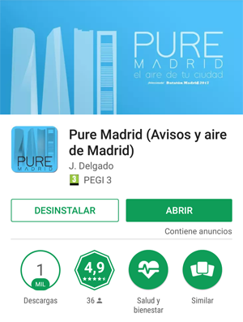
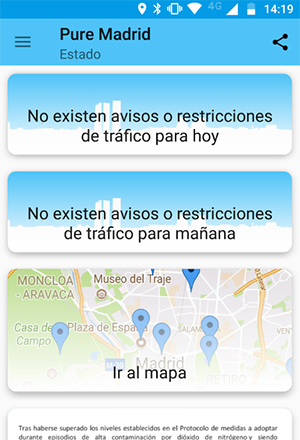
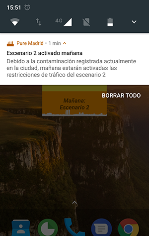
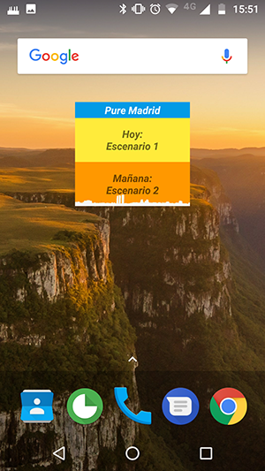

# Pure Madrid

Pure Madrid es una app desarrollada para la plataforma Android que permite a los ciudadanos de Madrid conocer toda la información relativa al aire de la ciudad, incluyendo las restricciones de tráfico aplicadas en cada momento.

El propósito de esta app es mejorar la información de todos los ciudadanos que vivan o visiten Madrid y mostrar el nivel de contaminación de la ciudad de Madrid en tiempo real y también toda la información correspondiente a los protocolos de contaminación mediante el envío de notificaciones. Los destinatarios de la app son los ciudadanos de Madrid y también aquellas personas que visiten la ciudad, aunque les será de más utilidad a todos aquellos que utilicen habitualmente el vehículo privado para desplazarse. 

Todo esto lo hacemos utilizando los datos de contaminación en tiempo real del Portal de Datos Abiertos de Madrid (http://datos.madrid.es/) extrayendo toda la información y dándole un formato que sea fácil de interpretar por los usuarios.

La app está disponible en Google Play desde el mes de octubre para permitir que los ciudadanos la disfrutasen durante toda la temporada de contaminación elevada y puede obtenerse en el siguiente enlace:
https://play.google.com/store/apps/details?id=com.albaitdevs.puremadrid

Durante este periodo, la app ha sido instalada por más de 1000 ciudadanos que han recibido notificaciones automáticas durante los tres episodios de contaminación elevada que han tenido lugar esta temporada, siendo el más prolongado el de mediados de noviembre con una duración superior a una semana.

Además, de entre todos los usuarios que han disfrutado de la app, más de 35 han valorado la aplicación con una nota media de 4,9 sobre 5 en Google Play

## Promotor

* Javier Delgado Aylagas

* Icono: Hector Rodríguez

## Funcionalidad

* La página principal contiene los avisos del protocolo de contaminación para hoy y mañana (junto con el envío de notificaciones automáticas)
* Mapa con los datos de todas las estaciones y todos los contaminantes con datos históricos desde el 1 de enero de 2017.
* Previsión oficial para hoy y mañana
* Widget de escritorio que muestra los escenarios activados.
* Documentación explicando los detalles del protocolo de contaminación.
* Enlaces a la web oficial y a los boletines diarios de contaminación oficiales.

## Cómo utilizar la app:

Nada mas abrir la aplicación, veremos el estado del aire en este instante, y en el momento que cambie se verá el estado de la aplicación:

Para que el usuario disponga de la información tan pronto como es publicada, recibirá una notificación con la información más relevante:

Al pulsar sobre los estados de hoy o mañana, veremos las afecciones que tiene el escenario actual para el tráfico:

En la sección de mapa, podremos ver los datos de diferentes tipos de contaminantes, tanto sobre un mapa coloreado, como seleccionando en los medidores para poder ver datos más concretos. Además, el color del medidor cambiará a amarillo si se supera el nivel de preaviso (180 microgramos/m3), a naranja si se supera el nivel de aviso (200 microgramos/m3) y a rojo si se supera el nivel de alerta (400 microgramos/m3).

Para consultar los datos históricos, simplemente hay que pulsar sobre el botón de calendario y cambiar la fecha:

También se puede consultar la previsión oficial de contaminación, a parte del documento que define el protocolo y los boletines diarios del Ayuntamiento.

Por último, la app dispone de un widget de escritorio para poder consultar el estado de la contaminación sin tener que entrar a la app:

## API

El código que se incluye en el proyecto Pure Madrid, incluye un servidor listo para su utilización en Google App Engine y el código de la aplicación Android anteriormente mencionada.

La información es almacenada cada hora en Google Datastore desde donde es accedida por la app a través de los Google Cloud Endpoints utilizando una API Rest.

Las principales peticiones que implementa la api son:

* __getNewData__: Almacena la información generada desde la ultima petición hasta el momento actual. Además, en caso de que el fichero de datos en tiempo real esté caido, este método recuperará toda la información en cuanto vuelva a estar disponible, actualizando así toda la información generada desde la última vez que estuvo disponible. Este método es utilizado a través de un Cron que mantiene la información de la base datos cada hora. La única información que devuelve la llamada es si se ha actualizado algún dato o no. Esta llamada nunca se usa externamente. En el servidor de prueba desplegado para que pueda ser utilizado en el concurso se dispone de información de 8 contaminantes diferentes desde el 22 de Octubre de 2017. Este método gestiona de manera automática los avisos por contaminación y en caso de estar en un episodio de contaminación activo, envía notificaciones push a la app con el estado actual.

* __getLastStatus__: Devuelve los datos de la última hora almacenada sobre todos los contaminantes medidos en el servidor. Utiliza un formato JSON que se puede ver en la siguiente imagen. Esta llamada se utiliza en el momento de abrir la app o el mapa para disponer de los datos más recientes disponibles.

* __getStatusAt/[fecha_hora]__: Devuelve los datos de todos los contaminantes medidos en la hora seleccionada. Utiliza el mismo formato que se puede ver a continuación. Esta llamada se utiliza únicamente en el mapa al cambiar la fecha seleccionada.

* __setManualScenario__ y __setManualScenarioToday__: Permiten gestionar manualmente los avisos de restricciones de tráfico. Ambas envían una notificación push a la app utilizando Firebase.

## Información utilizada

Toda la información de esta aplicación es obtenida en tiempo real a través del Portal de datos abiertos de Madrid: http://datos.madrid.es

## Documentación del proyecto

La documentación completa del proyecto se encuentra en [docs](docs/)

## Claves necesarias:

Para que FCM y la conexión con Google App Engine funcionen correctamente, es necesario añadir un fichero google-services.json de Firebase.
Además, es necesario configurar los siguientes valores con los de nuestro servidor:

your_key_google_maps
your_api_url
ACCES_TOKEN_USERPASS
GCM_API_KEY_PROD

Algunas de estas claves están preconfiguradas, y el proyecto de Google correspondiente se cerrará una vez finalizado el Datatón. Para mayor seguridad, se deben utilizar claves propias.

## Licencia

El proyecto utiliza la Licencia Apache 2.0:

Copyright (C) 2017 Javier Delgado Aylagas

Licensed under the Apache License, Version 2.0 (the "License");
you may not use this file except in compliance with the License.
You may obtain a copy of the License at

     http://www.apache.org/licenses/LICENSE-2.0

Unless required by applicable law or agreed to in writing, software
distributed under the License is distributed on an "AS IS" BASIS,
WITHOUT WARRANTIES OR CONDITIONS OF ANY KIND, either express or implied.
See the License for the specific language governing permissions and
limitations under the License.
