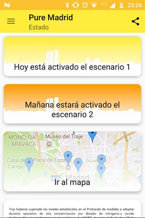
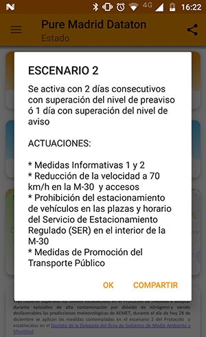
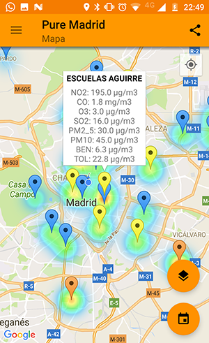

# Pure Madrid

Este proyecto consiste en una aplicación desarrollada para la plataforma Android que permite a los ciudadanos de Madrid conocer toda la información relativa al aire de la ciudad, incluyendo las restricciones de tráfico aplicadas en cada momento.

El propósito de esta app es mostrar el nivel de contaminación de la ciudad de Madrid en tiempo real y también toda la información correspondiente a los protocolos de contaminación mediante el envío de notificaciones. Los destinatarios de la app son los ciudadanos de Madrid y también aquellas personas que visiten la ciudad, aunque les será de más utilidad a todos aquellos que utilicen habitualmente el vehículo privado para desplazarse. 

## Promotor

* Javier Delgado Aylagas

## Funcionalidad

* La página principal contiene los avisos del protocolo de contaminación para hoy y mañana (junto con el envío de notificaciones automáticas)
* Mapa con los datos de todas las estaciones y todos los contaminantes con datos históricos desde el 1 de enero de 2017.
* Previsión oficial para hoy y mañana
* Widget de escritorio que muestra los escenarios activados.
* Documentación explicando los detalles del protocolo de contaminación.
* Enlaces a la web oficial y a los boletines diarios de contaminación oficiales.

## Información utilizada

Toda la información de esta aplicación es obtenida del Portal de datos abiertos de Madrid: http://datos.madrid.es

## Documentación del proyecto

La documentación se encuentra en [docs](docs/)

## Claves necesarias:

Para que FCM y la conexión con Google App Engine funcionen correctamente, es necesario añadir un fichero google-services.json de Firebase.
Además, es necesario configurar los siguientes valores con los de nuestro servidor:

your_key_google_maps
your_api_url
ACCES_TOKEN_USERPASS
GCM_API_KEY_PROD

Algunas de estas claves están preconfiguradas, y el proyecto correspondiente se cerrará una vez finalizado el Datatón.

## Capturas de pantalla

